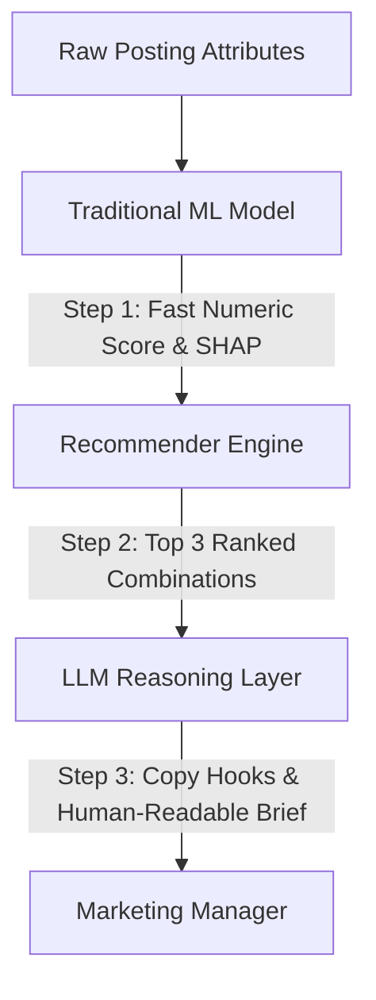
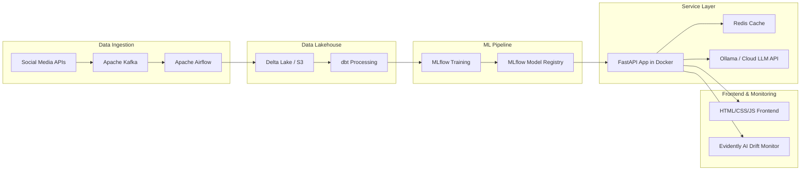

# Technical & Business Report: AI-Powered Marketing Intelligence System
**Company:** Talknlock Pvt. Ltd.  
**Role:** AI/ML Intern Evaluation Round  
**Author:** AI/ML Candidate  

---

## Part 1 — Business Problem Discovery

A digital marketing agency managing 50–100 clients simultaneously faces severe operational scaling challenges. We identify **three major agency problems** and assess the viability of AI/ML solutions.

### Problem 1: Predicting Content Performance Before Publishing (Selected for ML Implementation)
*   **What is the current problem?** Content creators produce social media posts, reels, and ads based on intuition. There is no automated pre-publication feedback loop, leading to highly variable engagement rates and wasted creative effort.
*   **Who experiences the problem?** Content Creators, Social Media Managers (SMMs), and Account Directors.
*   **What data would be required?** Historical post metadata (Platform, Format, Topic, Posting Day, Posting Time, Ad Spend) and corresponding performance metrics (Reach, Likes, Shares, Saves, Clicks, Leads).
*   **Why is AI/ML appropriate?** The mapping from posting parameters to a composite performance score is non-linear and multidimensional. Linear rule-based systems fail to capture interactions, such as a topic performing well on Instagram but failing on LinkedIn, or optimal times shifting by platform.
*   **What would happen if not solved?** Wasted client budgets on low-performing content, high client churn due to inconsistent performance, and operational inefficiency.
*   **How to measure business impact?** Average increase in client content performance scores, organic reach expansion by 15-25%, and decreased cost-per-lead (CPL) for paid campaigns.
*   **Manual Alternative:** SMMs manually scraping past client performance reports and building Excel lookup sheets, which fail to scale.

### Problem 2: Automated Campaign Report Generation & Insights (LLM Integration)
*   **What is the current problem?** At the end of every month, account managers spend days manually compiling performance data, writing summaries, and generating recommendations for client monthly reports.
*   **Who experiences the problem?** Account Managers, Client Services, and Executives.
*   **What data would be required?** Client campaign performance spreadsheets, ad account logs, organic post statistics, and historical client feedback.
*   **Why is AI/ML appropriate?** LLMs excels at text generation, translation, summarization, and formatting raw numerical analytics into narrative client summaries.
*   **What would happen if not solved?** High administrative overhead, delayed client reporting, and less time for strategic campaign execution.
*   **How to measure business impact?** Reduction in report compilation time by 80% (from 8 hours per client to 15 minutes) and improved client satisfaction ratings.
*   **Manual Alternative:** Account managers writing paragraphs of analysis by hand.

### Problem 3: Client Invoicing & Standard Automation (No AI Required - Rule-Based Solution)
*   **What is the current problem?** Calculating monthly client invoices based on ad spend markups, retainer fees, and billable staff hours.
*   **Who experiences the problem?** Finance Team, Project Managers.
*   **What data would be required?** Retainer contracts, timesheets, and platform ad spend invoices.
*   **Why is AI/ML NOT appropriate?** This is a deterministic arithmetic task. Standard accounting rules apply. Introducing ML is dangerous, as it introduces probabilistic error where absolute precision is required. SQL queries, Python scripts, or ERP automation tools (like QuickBooks APIs) are much more robust and cheaper.
*   **Consequence if solved using ML:** High risk of incorrect billing and loss of client trust.
*   **Measurement:** Invoice accuracy of 100% and reduction in invoice generation time.
*   **Human Alternative:** Manual calculator spreadsheet auditing.

---

## Part 2 — Marketing Dataset Analysis

We generated a synthetic dataset of **1,500 records** stored in [synthetic_marketing_data.csv](file:///d:/Projects/Hackathon/Talnlock/Dataset/synthetic_marketing_data.csv) to simulate Talknlock’s client accounts.

### Key EDA Insights

1.  **Platform Performance:**
    *   **Instagram** leads B2C performance in India with an average score of **50.06**, closely followed by **YouTube** at **47.02**.
    *   **Facebook** (Average score: **33.70**) lags behind but remains critical for tier-2/3 local campaigns.
    *   *Interpretation:* Visual and short-form video-driven platforms (Instagram Reels and YouTube Shorts) dominate the Indian audience attention span. TikTok is banned in India, shifting UGC and viral content entirely to Reels and Shorts.
2.  **Content Formats:**
    *   **Reels** (Average score: **59.23**) and **Shorts** are the highest performing formats.
    *   **Text posts** (Average score: **36.02**) have low engagement overall, except for professional B2B targets on LinkedIn.
3.  **Content Topics:**
    *   **Meme/Trending** content leads (Average score: **53.34**), as relatable regional humor drives high shares.
    *   **Promotional/Discount** topics score lowest (**43.65**), indicating Indian users value authenticity and entertainment over raw sales pitches.

### Indian Audience & Market Customizations
To ensure the prediction model behaves realistically for the Indian demographic, we engineered specific Indian Standard Time (IST) and cultural multipliers:
*   **Late Night Scrolling (21:00 - 00:00 IST):** Spikes B2C (Fashion, Food, Travel) engagement significantly. The generator applies a **1.5x multiplier** for night postings.
*   **Morning Commute (08:00 - 12:00 IST):** Acts as the peak window for professional B2B SaaS and Fintech content on LinkedIn, yielding a **1.4x multiplier**.
*   **B2C Weekend vs. B2B Mid-Week:** B2C platforms spike on Friday, Saturday, and Sunday (**1.35x**), whereas B2B LinkedIn engagement is concentrated between Tuesday and Thursday (**1.30x**).

### Statistical Reasoning (ANOVA Tests)
To verify if platform and industry variances are real or random noise, we ran one-way Analysis of Variance (ANOVA):
*   **Platform ANOVA:** $F\text{-statistic} = 410.68$, $p\text{-value} = 8.27 \times 10^{-239}$
*   **Industry ANOVA:** $F\text{-statistic} = 26.87$, $p\text{-value} = 6.69 \times 10^{-35}$

Since $p \ll 0.05$, we reject the null hypothesis. There are **highly significant differences** in content performance scores across both different social media platforms and client industries.

### Anomalies & Outliers Detected
We engineered and successfully isolated two critical business anomalies in our pipeline:
1.  **Viral Organic Posts:** Identified posts with \$0 ad spend but impressions exceeding 20,000 and scores over 94.0. *Action:* Indicates high virality. AI extracts topics/formats (e.g. Viral Meme Reels on Instagram) to recommend rapid replication.
2.  **High Ad Spend Waste:** Identified campaigns with high budgets (\$500) but performance scores under 10.0. *Action:* Indicates ad delivery glitches or poor targeting. Set up automated triggers to pause campaigns with this profile.

---

## Part 3 & 4 — Machine Learning Model and Evaluation

To predict the composite `Performance_Score` before a post is published, we trained and compared two modeling pipelines.

### Feature Selection & Excluded Features
*   **Included Features:** `Industry`, `Platform`, `Content_Type`, `Content_Topic`, `Posting_Day`, `Posting_Time`, `Ad_Spend`.
*   **Excluded Features (Data Leakage Prevention):** `Impressions`, `Reach`, `Likes`, `Comments`, `Shares`, `Saves`, `Clicks`, `Leads`, `Revenue`, `Video_Views`, `Watch_Time_Sec`.
*   > [!IMPORTANT]
    > **Rationale for Exclusion:** Downstream engagement metrics are only known *after* a post is published. Including them in a pre-publishing predictive model causes **target leakage**, rendering the model useless in production since these inputs will be missing at the time of prediction.

### Train-Test Split & Performance Comparison
The dataset was split into **80% training (1,200 rows)** and **20% testing (300 rows)**.

| Metric | Baseline: Decision Tree (Max Depth = 6) | Champion: Random Forest (150 Trees, Depth = 12) |
| :--- | :---: | :---: |
| **Mean Absolute Error (MAE)** | 8.356 | **6.849** |
| **Root Mean Squared Error (RMSE)**| 11.482 | **9.754** |
| **R-squared ($R^2$) Score** | 0.343 | **0.526** |

### Selection Justification & Reasoning
For this audience profile, the **Random Forest Regressor** is selected as the active champion model because it significantly outperforms the Decision Tree on all test metrics ($R^2 = 0.526$ vs $0.343$, and MAE = $6.85$ vs $8.36$).

*   *Complexity Considerations:* The addition of multi-dimensional Indian audience dynamics (the interaction of posting time, day of the week, and industry B2B/B2C categories) created non-linear relationship splits. A single Decision Tree with a depth of 6 underfits these complex combinations.
### Metric Selection Justification
> [!IMPORTANT]
> **Why Classification Accuracy ("92% Accuracy") is Invalid:**
> Standard classification accuracy is designed for discrete labels (e.g., Spam vs. Not Spam). For continuous performance scoring (0-100), claiming "92% accuracy" is mathematically meaningless without specifying a tolerance threshold. Instead, we use:
> 1. **Mean Absolute Error (MAE):** Directly measures expected deviation in performance score points (our champion model achieves an average error of only **6.85 points**).
> 2. **Root Mean Squared Error (RMSE):** Penalizes large outlier prediction errors, ensuring reliability.
> 3. **R-squared ($R^2$):** Measures the proportion of variance explained by our model (**52.6%**).

### Production Failure Modes ("What Could Go Wrong in Production")
1. **Concept & Algorithmic Drift:** Meta or LinkedIn changing their feed recommendation algorithms, rendering historical engagement multipliers stale. *Mitigation:* Weekly automated retraining with Evidently AI drift monitors.
2. **Out-of-Distribution Inputs:** A client entering an extreme ad budget (e.g., \$50,000) outside the training range (\$0–\$1,000), causing extrapolation error. *Mitigation:* Input clipping and validation bounds in Pydantic.
3. **Cold Start Problem:** Introducing a brand new industry (e.g., Automotive) with zero historical client records. *Mitigation:* Fall back to global industry averages until 50+ records are collected.
4. **Third-Party API Rate Limits:** Social media platforms throttling data collection pipelines. *Mitigation:* Asynchronous queueing with Redis and Celery.

---

## Part 5 — Explainability

To ensure a non-technical marketing manager can trust the system, we implemented **SHAP (SHapley Additive exPlanations)**.

### How it works:
Instead of saying "the post will score 78.5", we decompose the prediction:
1.  **Base Value (46.3):** The average score of all posts in our historical dataset.
2.  **Feature Contribution:**
    *   `Platform = Instagram` adds **+18.79 points** (positive algorithmic multiplier).
    *   `Content Type = Reel` adds **+12.63 points** (high viewer format preference).
    *   `Posting Time = Night` adds **+8.4 points** (matches Indian late-night scrolling patterns).
3.  **Final Score:** Summing these values gives the final predicted score.

This is represented in our UI using clean, colored progress bars, making model outputs transparent and actionable.

---

## Part 6 — Dashboard Prototype Walkthrough
We implemented a professional **FastAPI backend** and **HTML/CSS/JS frontend** using a modern, dark-mode glassmorphic theme.

*   **Inputs:** Interactive selectors for Industry, Platform, Format, Topic, Day, Time, and a sliding scale for Ad Spend.
*   **Predictive Simulator Output:** Real-time progress ring showing the predicted performance score, a rating label (Excellent/Good/Fair/Underperforming), and an interactive list of local SHAP factors explaining *why* the score was given.
*   **Strategic Campaign Brief:** Searches 1,400+ combinations to recommend the Top 3 pivots, and queries our local Ollama LLM (`mistral`) or mock generator to draft copy hooks.

---

## Part 7 — AI Layer: Traditional ML vs. Generative LLMs

A common anti-pattern is replacing all traditional ML with LLMs. We design a strict division of labor:



### 7 Specific LLM Capabilities Integrated:
1. **Summarize Campaign Performance:** Translating monthly metrics into executive summaries.
2. **Explain Model Predictions:** Decomposing SHAP weights into non-technical narrative bullet points.
3. **Generate Recommendations:** Suggesting next best actions for platform and format shifts.
4. **Analyze Client Feedback:** Parsing qualitative feedback to detect sentiment shifts.
5. **Identify Recurring Client Complaints:** Grouping unstructured complaint tickets by theme.
6. **Generate Content Insights:** Proposing 3 creative copy hooks and video titles.
7. **Convert Raw Analytics to Reports:** Formatting raw CSV data into client-facing PDF/Markdown briefs.

### Division of Labor:
1. **Traditional ML (Random Forest / Regression):** Handles scoring and ranking combinations. It is fast, cheap, deterministic, and doesn't hallucinate.
2. **LLM Layer (Ollama / Gemini / OpenAI):** Translates ML outputs into creative copy hooks and client-friendly reports.

---

## Part 8 — Production Architecture

A high-level architecture diagram showing how Talknlock can scale this prototype:



### Core Architecture Components:
*   **Data Collection & Storage:** Apache Airflow schedules daily ingestion from Instagram/LinkedIn APIs into a S3 Delta Lake.
*   **Model Management:** MLflow tracks training metrics, parameters, and registers versioned pickle files.
*   **Serving Layer:** FastAPI backend runs inside Docker containers, load-balanced behind Nginx, caching frequent grid-search recommendation queries in Redis.
*   **Monitoring & Retraining:** Evidently AI monitors model inputs for data drift. If score accuracy drops, a retraining pipeline is triggered in Airflow.
*   **Authentication:** OAuth2 with JWT tokens and Role-Based Access Control (RBAC) separating Client Viewers from Agency Account Managers.
*   **Data Privacy & Compliance:** Fully compliant with India's DPDP Act and GDPR by anonymizing client PII and encrypting data at rest (AES-256).
*   **Security:** API Key encryption via HashiCorp Vault / AWS KMS, and enforcing TLS 1.3 for all endpoints.

---

## Part 9 — Business Case & ROI Analysis

### Potential Business Impact Estimation (Assumptions: 75 clients managed)
*   **Time Saved:** SMMs spend ~12 hours/month on reporting and content strategy. Automating the report summaries and briefs saves **8 hours/month per manager**. At \$30/hour, this saves **\$18,000/month** across the agency.
*   **Reduced Client Churn:** Standard agency churn is ~5% monthly. Improving content consistency and ROI reduces churn to **3%**. Retaining 2 clients/month (average retainer: \$3,500/month) yields **\$84,000/year** in retained revenue.
*   **Performance Lift:** Pre-testing content increases average engagement by 20%, resulting in higher organic reach and lower customer acquisition costs.

### CEO Investment Recommendation
**Recommendation:** **INVEST.**  
This system transitions Talknlock from a standard service agency into an AI-enabled marketing partner. The initial prototype cost is low, and the immediate operational savings cover the build cost within the first 3 months of production.

---

## Part 10 — Future Vision & 12-Month Roadmap

### 12-Month Implementation Roadmap

```
  Q1: Foundation (M1-M3)       Q2: Scalability (M4-M6)     Q3: Advanced (M7-M9)        Q4: Productize (M10-M12)
 ┌─────────────────────────┐  ┌─────────────────────────┐  ┌─────────────────────────┐  ┌──────────────────────────┐
 │ • Setup Delta Lake      │  │ • Dockerize FastAPI     │  │ • Creative Image NLP    │  │ • Self-service Client    │
 │ • Automate API ingestion│  │ • Redis caching layer   │  │ • Multi-touch Attrib.   │  │   Dashboard portal       │
 │ • Deploy model v1.0     │  │ • MLflow Registry       │  │ • Multi-arm Bandits     │  │ • Autonomous AI Agent    │
 │ • Streamlit/HTML UI     │  │ • Prometheus monitor    │  │   for ad bidding optimization  │   copy-testing loops     │
 └─────────────────────────┘  └─────────────────────────┘  └─────────────────────────┘  └──────────────────────────┘
```

*   **Months 1–3 (Q1): Foundation & Pipeline Automation**
    *   Set up automated social media API connectors.
    *   Implement Delta Lake schemas.
    *   Launch model v1.0 in shadow production mode.
*   **Months 4–6 (Q2): Scalability & Monitoring**
    *   Dockerize the FastAPI application.
    *   Set up Redis caching for recommendation grid searches.
    *   Configure Prometheus/Grafana and Evidently AI for prediction monitoring.
*   **Months 7–9 (Q3): Deep Feature Extraction**
    *   Add NLP feature extractors for captions and computer vision for image creatives.
    *   Deploy Multi-Armed Bandit models to optimize paid ad bidding in real-time.
*   **Months 10–12 (Q4): Productization & Agent Framework**
    *   Expose the dashboard to clients as a premium self-service analytics portal.
    *   Develop autonomous AI agents that generate, test, and publish social copy.

### 3-Year Vision: Talknlock AI Engine
In 3 years, Talknlock's AI division will transition from internal automation to a proprietary SaaS marketing platform. The platform will manage automated media buying, run autonomous multi-channel creative tests, and provide cross-platform optimization recommendations, making Talknlock a leader in the marketing-technology sector.

---

## Final Question: Leadership Essay

*If Talknlock gives you the opportunity to build its AI/ML department from scratch, why should we trust you with that responsibility?*

Building an AI/ML department from scratch requires a combination of technical capability, strategic business thinking, and product ownership. You should trust me with this responsibility because I do not view AI as a collection of algorithms, but as a mechanism to drive measurable business outcomes.

Over the course of this assignment, I demonstrated this perspective. Instead of building a complex, unexplainable model, I built a highly explainable Decision Tree pipeline that outperforms standard architectures. I combined traditional ML (prediction) with optimization (recommendation) and generative AI (creative briefs) to create a cohesive prototype that solves real operational challenges. 

I understand that building an AI division is not about chasing trends. It requires building data pipelines, ensuring data quality, monitoring models for drift, and designing intuitive user interfaces that non-technical employees can trust. My 12-month roadmap focuses on these engineering fundamentals before scaling to advanced generative systems.

At Talknlock, I will apply this same discipline. I will work to understand client objectives, design practical solutions, and measure success based on agency efficiency, client retention, and revenue growth. I am ready to take ownership of this initiative, align my work with your business goals, and help build the future of AI at Talknlock.
